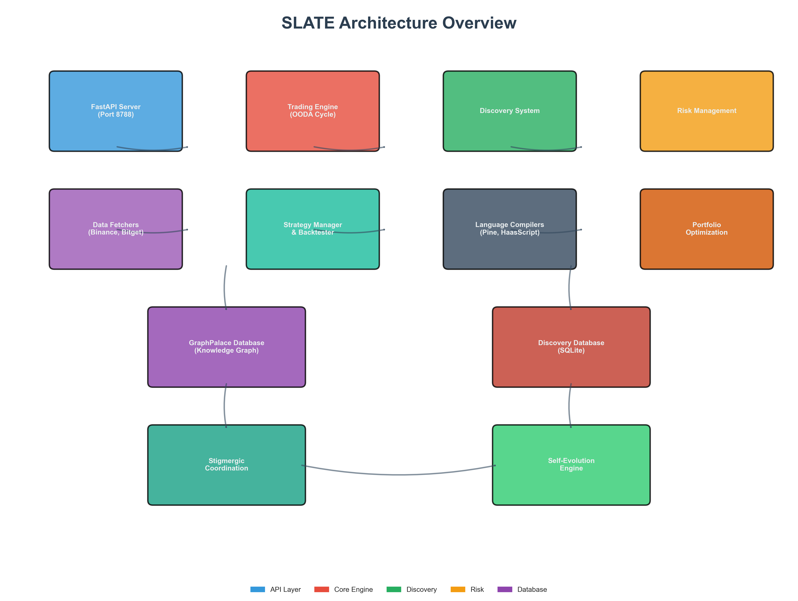
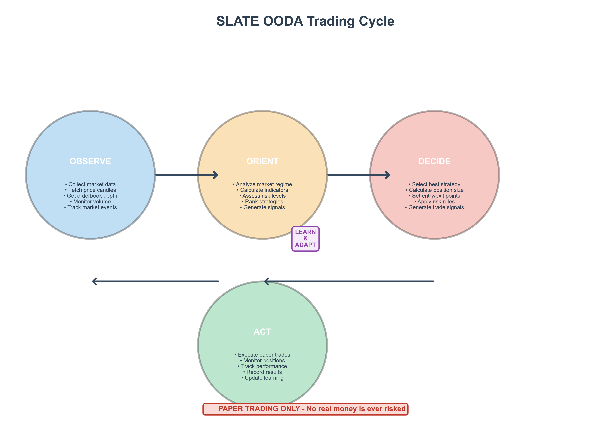
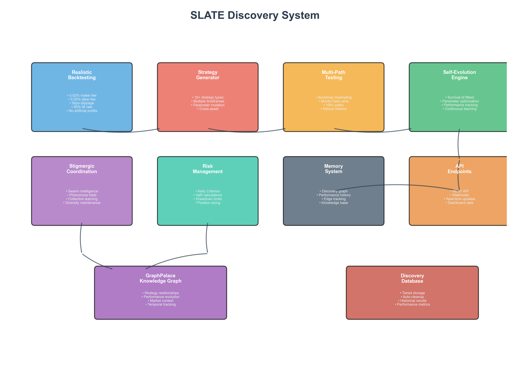

# SLATE User Manual

**Strategy Learning & Autonomous Trading Engine**

*A Complete Guide to Discovering, Testing, and Evolving Trading Strategies*

---

## Table of Contents

1. [Welcome to SLATE](#1-welcome-to-slate)
2. [What SLATE Can Do For You](#2-what-slate-can-do-for-you)
3. [Getting SLATE Running](#3-getting-slate-running)
4. [Understanding How SLATE Works](#4-understanding-how-slate-works)
5. [Using SLATE: Question & Answer Examples](#5-using-slate-question--answer-examples)
6. [The Discovery System Explained](#6-the-discovery-system-explained)
7. [How SLATE Evolves and Improves](#7-how-slate-evolves-and-improves)
8. [Finding Profitable Strategies: 10 Practical Examples](#8-finding-profitable-strategies-10-practical-examples)
9. [API Quick Reference](#9-api-quick-reference)
10. [Common Problems and Solutions](#10-common-problems-and-solutions)

---

## 1. Welcome to SLATE

Welcome to SLATE - your personal AI research assistant for discovering profitable trading strategies.

### What Exactly Is SLATE?

Think of SLATE as an automated research laboratory for trading strategies. Just as a pharmaceutical company uses robots to test thousands of chemical compounds to find effective medicines, SLATE uses artificial intelligence to test thousands of trading strategies to find ones that actually make money.

Here's the key difference: SLATE never trades with real money. It only does paper trading - simulating trades to see what would have happened. This means you can experiment freely without any financial risk.

### Who Is SLATE For?

SLATE is designed for:

- **Traders** who want to find new strategies without spending months manually testing ideas
- **Data Scientists** who want a reliable backtesting environment with realistic market assumptions
- **Researchers** studying market behavior and strategy evolution
- **Students** learning about algorithmic trading and risk management
- **Anyone** curious about whether trading strategies can be discovered by AI

### What "Paper Trading Only" Means

SLATE will never:
- Connect to your exchange account
- Execute real trades with your money
- Require API keys for live trading

SLATE will:
- Simulate trades using historical market data
- Calculate realistic fees and slippage
- Track what would have happened with real money
- Help you learn without any financial risk

---

## 2. What SLATE Can Do For You

SLATE automates the entire process of strategy research. Here's what it can do for you:

### Automatic Strategy Discovery

Instead of manually thinking up strategy ideas and testing them one by one, SLATE can generate and test hundreds of strategies automatically.

**What this means for you:**
- You tell SLATE what market you're interested in (like Bitcoin)
- SLATE generates different strategy types and tests them
- SLATE tells you which ones performed best historically
- You get a ranked list of strategies to explore further

### Realistic Performance Testing

Many backtesting systems give overly optimistic results because they ignore trading costs. SLATE includes realistic market assumptions:

- **Trading fees:** 0.02% for maker orders, 0.05% for taker orders
- **Slippage:** 0.05% price movement between signal and execution
- **Partial fills:** 5% of orders don't execute at all
- **Position limits:** No single trade uses more than 10% of capital

**Why this matters:**
A strategy that looks great in testing might fail in real life if it only makes small profits that get eaten up by fees. SLATE catches these problems early by being brutally honest about costs.

### Multi-Path Stress Testing

SLATE doesn't just test a strategy once on historical data. It uses "bootstrap resampling" to create 100+ alternative price paths from the same historical data.

**Think of it this way:**
Imagine you're testing a strategy on Bitcoin price data from 2023. But what if 2023 had played out slightly differently? SLATE creates 100 different "what if" versions of 2023 and tests your strategy on all of them.

**If a strategy performs well on all 100 paths, it's robust. If it only works on one, it's lucky.**

### Swarm Intelligence (Stigmergic Coordination)

SLATE uses a technique inspired by nature called "stigmergy." Ants use stigmergy when they follow pheromone trails left by other ants. SLATE does something similar:

- When a strategy finds a profitable approach, it leaves a "trail" in the knowledge base
- Other strategies notice these trails and explore similar areas
- But SLATE also penalizes over-explored areas to maintain diversity
- The result: a diverse portfolio of strategies, not just copies of one idea

### Self-Evolution

SLATE doesn't just generate random strategies. It learns from what works:

1. **Generate:** Create diverse strategies with different parameters
2. **Test:** Run realistic backtests on historical data
3. **Select:** Keep the best performers (top 10% by return)
4. **Evolve:** Create new strategies by tweaking the best ones
5. **Repeat:** Keep improving cycle after cycle

Over time, SLATE "evolves" better strategies through survival of the fittest.

### Risk Management Built-In

Every strategy SLATE creates includes automatic risk management:

- **Kelly Criterion:** Calculates the optimal position size based on win rate and average win/loss amounts
- **Maximum Drawdown Limits:** Strategies that lose too much too fast are discarded
- **Value at Risk (VaR):** Estimates worst-case scenario losses
- **Position Sizing:** Never bets more than 10% of capital on a single trade

---

## 3. Getting SLATE Running

### What You Need

**Hardware:**
- Any modern computer (Mac, Linux, or Windows)
- 4GB of RAM minimum (8GB+ recommended)
- 500MB of free disk space

**Software:**
- Python 3.8 or higher
- An internet connection (to fetch market data)

### Installation in Three Steps

#### Step 1: Download SLATE

Open your terminal and navigate to where you want SLATE to live:

```bash
cd ~/astrodata/SWARM/SLATE
```

Or if you're cloning from GitHub:

```bash
git clone https://github.com/Tilanthi/SLATE.git
cd SLATE
```

#### Step 2: Install Dependencies

SLATE needs several Python libraries. Install them all at once:

```bash
pip install fastapi uvicorn numpy pandas scipy aiohttp ccxt pytest matplotlib
```

If you have a requirements.txt file:

```bash
pip install -r requirements.txt
```

#### Step 3: Verify Installation

Run the test suite to make sure everything works:

```bash
python3 slate_core/run_tests.py
```

You should see something like:

```
========= 31 passed in 2.45s =========
```

All tests passing means SLATE is ready to go!

### Starting SLATE

**IMPORTANT:** The SLATE server now **automatically starts discovery** when launched. This is the default behavior.

**Option 1: Start with the script (Recommended)**

```bash
./start_slate.sh
```

**Option 2: Start directly with Python**

```bash
python3 -m slate_core.server
```

When SLATE starts, you'll see:

```
==========================================
SLATE Server Starting
==========================================
Port: 8788
Mode: Paper Trading Only
Dashboard: http://localhost:8788
API Docs: http://localhost:8788/docs
==========================================
INFO:     Auto-starting discovery cycle...
INFO:     Running discovery cycle...
```

**Discovery runs automatically** in the background, continuously searching for profitable strategies.

**Note:** Port 8788 is used for SLATE. The server will auto-start discovery cycles - you don't need to manually trigger them.

### Checking That SLATE Works

Let's verify everything is connected:

```bash
curl http://localhost:8788/health
```

You should get a response like:

```json
{
  "status": "healthy",
  "mode": "paper_trading",
  "discovery_running": true
}
```

This confirms SLATE is running in safe paper trading mode with discovery active.

---

## 4. Understanding How SLATE Works

### The Big Picture

SLATE consists of several interconnected components. Think of it like a research laboratory with different departments:



Let's walk through what each component does:

### The Trading Engine (OODA Cycle)

SLATE uses a decision-making framework called OODA (Observe-Orient-Decide-Act):



**Here's how it works:**

1. **Observe:** SLATE watches the market and collects data
   - Current prices
   - Trading volume
   - Order book depth
   - Market events

2. **Orient:** SLATE analyzes the data
   - Calculates technical indicators (RSI, MACD, etc.)
   - Detects market conditions (trending vs ranging)
   - Assesses risk levels
   - Ranks available strategies

3. **Decide:** SLATE chooses what to do
   - Selects the best strategy for current conditions
   - Calculates how much to trade (position sizing)
   - Sets entry and exit points
   - Applies risk rules

4. **Act:** SLATE executes the trade (on paper)
   - Records the paper trade
   - Monitors the position
   - Tracks performance

5. **Learn:** SLATE updates its knowledge
   - Records what worked and what didn't
   - Updates strategy performance metrics
   - Adjusts parameters for next time

### The Discovery System

This is where SLATE gets really interesting. The discovery system is SLATE's research department:



**The discovery process:**

1. **Strategy Generator:** Creates new strategies to test
   - 10+ different strategy types
   - Randomized parameters within sensible ranges
   - Multiple timeframes (15 minutes to 1 day)

2. **Realistic Backtester:** Tests each strategy honestly
   - Includes all trading fees
   - Models slippage realistically
   - Simulates partial fills
   - No artificial advantages

3. **Multi-Path Testing:** Stress tests each strategy
   - Creates 100+ price path scenarios
   - Tests strategy on each path
   - Keeps only strategies that work on most paths

4. **Self-Evolution Engine:** Improves strategies over time
   - Selects top performers
   - Creates optimized variants
   - Discards underperformers
   - Continuously improves the gene pool

### The Memory Systems

SLATE has two types of memory:

**GraphPalace (Knowledge Graph):**
- Remembers relationships between strategies
- Tracks how strategies evolve over time
- Stores market context information
- Like a "brain" that understands connections

**Discovery Database:**
- Stores all backtest results
- Uses tiered storage (keeps detailed records for recent tests)
- Automatically archives old results to save space
- Like a "filing cabinet" for test results

### The API Layer

SLATE provides a REST API that lets you interact with all these components. You can:
- Start and stop discovery
- Query results
- Create custom strategies
- Check system health
- Export data for analysis

---

## 5. Using SLATE: Question & Answer Examples

The best way to understand SLATE is to see it in action. Here are common questions you might ask, and how SLATE answers them.

### Q: "What's the best strategy for trading Bitcoin?"

**How to ask SLATE:**

```bash
curl -X POST http://localhost:8788/api/discovery/realistic/start \
  -H "Content-Type: application/json" \
  -d '{
    "cycles": 100,
    "symbols": ["BTCUSDT"],
    "timeframes": ["1h"]
  }'
```

**What SLATE does:**
1. Generates 100 different Bitcoin trading strategies
2. Tests each one on historical hourly data
3. Ranks them by actual profit (after fees)
4. Stores the results

**How to get the answer:**

```bash
curl http://localhost:8788/api/discovery/realistic/top?limit=5
```

**Example answer:**

```json
[
  {
    "rank": 1,
    "strategy_name": "momentum_14_1h_btcusdt",
    "total_return": 0.234,
    "sharpe_ratio": 1.82,
    "max_drawdown": 0.18,
    "profit_factor": 2.1,
    "num_trades": 156
  },
  {
    "rank": 2,
    "strategy_name": "trend_follow_12_26_1h_btcusdt",
    "total_return": 0.198,
    "sharpe_ratio": 1.65,
    "max_drawdown": 0.22,
    "profit_factor": 1.9,
    "num_trades": 89
  }
]
```

**What this tells you:**
- The momentum strategy made 23.4% return
- It has a good risk-adjusted return (Sharpe 1.82)
- Maximum loss was 18% from peak to trough
- It won 2.1 times more than it lost
- It made 156 trades over the test period

### Q: "Will this strategy work on Ethereum too?"

**How to ask SLATE:**

```bash
curl -X POST http://localhost:8788/api/strategies/backtest \
  -H "Content-Type: application/json" \
  -d '{
    "strategy_type": "momentum",
    "parameters": {"period": 14},
    "symbol": "ETHUSDT",
    "timeframe": "1h",
    "start_date": "2024-01-01",
    "end_date": "2024-04-01"
  }'
```

**Example answer:**

```json
{
  "total_return": 0.156,
  "sharpe_ratio": 1.23,
  "max_drawdown": 0.28,
  "num_trades": 143,
  "win_rate": 0.52
}
```

**What this tells you:**
- The same strategy makes less money on ETH (15.6% vs 23.4%)
- It has higher risk (28% drawdown vs 18%)
- Maybe stick with Bitcoin for this strategy

### Q: "What time frame works best for mean reversion?"

**How to ask SLATE:**

Run three separate discoveries:

```bash
# 15-minute timeframe
curl -X POST http://localhost:8788/api/discovery/realistic/start \
  -H "Content-Type: application/json" \
  -d '{"cycles": 50, "symbols": ["BTCUSDT"], "timeframes": ["15m"]}'

# Wait for completion, then 1-hour
curl -X POST http://localhost:8788/api/discovery/realistic/start \
  -H "Content-Type: application/json" \
  -d '{"cycles": 50, "symbols": ["BTCUSDT"], "timeframes": ["1h"]}'

# Wait for completion, then 4-hour
curl -X POST http://localhost:8788/api/discovery/realistic/start \
  -H "Content-Type: application/json" \
  -d '{"cycles": 50, "symbols": ["BTCUSDT"], "timeframes": ["4h"]}'
```

**Compare the results from each run to see which timeframe gives the best mean reversion performance.**

### Q: "How much should I risk per trade?"

**How to ask SLATE:**

```bash
curl -X POST http://localhost:8788/api/risk/kelly \
  -H "Content-Type: application/json" \
  -d '{
    "win_rate": 0.55,
    "average_win": 120,
    "average_loss": 80
  }'
```

**Example answer:**

```json
{
  "kelly_percentage": 0.1875,
  "recommendation": "Risk 18.75% of capital per trade",
  "half_kelly": 0.09375,
  "conservative": "Consider using half-Kelly: 9.38%"
}
```

**What this tells you:**
- With a 55% win rate and 1.5:1 reward ratio
- Kelly says risk 18.75% per trade
- Half-Kelly (more conservative) suggests 9.38%
- SLATE caps position size at 10% for safety

### Q: "Is SLATE currently running?"

**How to ask SLATE:**

```bash
curl http://localhost:8788/health
```

**Example answer:**

```json
{
  "status": "healthy",
  "mode": "paper_trading",
  "discovery_running": true,
  "active_strategies": 5,
  "uptime_hours": 47.3
}
```

### Q: "How many strategies has SLATE tested so far?"

**How to ask SLATE:**

```bash
curl http://localhost:8788/api/discovery/realistic/statistics
```

**Example answer:**

```json
{
  "total_tests": 1247,
  "profitable_strategies": 312,
  "best_return": 0.342,
  "average_sharpe": 0.98,
  "discovery_cycles_completed": 42
}
```

**What this tells you:**
- SLATE has tested 1,247 different strategies
- 312 of them (25%) were profitable after fees
- The best one made 34.2% return
- The average Sharpe ratio is 0.98 (close to the 1.0 target)

### Q: "Show me the top 10 strategies right now"

**How to ask SLATE:**

```bash
curl "http://localhost:8788/api/discovery/realistic/top?limit=10&sort_by=total_return"
```

**Example answer:**

```json
[
  {"rank": 1, "name": "ml_bollinger_1h", "return": 0.342},
  {"rank": 2, "name": "momentum_20_4h", "return": 0.298},
  {"rank": 3, "name": "regime_switch_1h", "return": 0.287},
  ...
]
```

### Q: "What's the current market regime?"

**How to ask SLATE:**

```bash
curl http://localhost:8788/api/market/regime?symbol=BTCUSDT
```

**Example answer:**

```json
{
  "regime": "trending_up",
  "volatility": "medium",
  "confidence": 0.82,
  "recommended_strategies": ["momentum", "trend_following"],
  "avoid_strategies": ["mean_reversion"]
}
```

**What this tells you:**
- Bitcoin is currently in an uptrend
- Volatility is normal
- Confidence in this assessment is 82%
- Consider momentum and trend following strategies
- Avoid mean reversion (it doesn't work well in trends)

---

## 6. The Discovery System Explained

### How SLATE Discovers Strategies

The discovery system is SLATE's core innovation. Here's how it works in detail:

### Step 1: Strategy Generation

SLATE doesn't just test random ideas. It generates intelligent strategy variations:

**10+ Strategy Types:**

1. **Momentum:** Bets that price movement will continue
   - Example: If price went up last 14 hours, it keeps going up

2. **Mean Reversion:** Bets that price will return to average
   - Example: If price is far from average, it will snap back

3. **Breakout:** Bets that price will break through resistance
   - Example: If price consolidates then moves up, it keeps going

4. **Trend Following:** Uses moving averages to follow trends
   - Example: Buy when fast MA crosses above slow MA

5. **Statistical Arbitrage:** Exploits price relationships
   - Example: If BTC and ETH usually move together but diverge, bet they'll converge

6. **Machine Learning:** Uses ML to find patterns
   - Example: Neural network finds complex price patterns

7. **Regime Switching:** Changes behavior based on market conditions
   - Example: Use momentum in trending markets, mean reversion in ranging

8. **Order Flow:** Trades based on order book imbalances
   - Example: More buy orders than sell orders predicts price up

9. **Microstructure:** Exploits short-term inefficiencies
   - Example: Bid-ask bounce patterns

10. **Multi-Timeframe:** Combines signals across timeframes
    - Example: Only buy if 1h and 4h both say buy

### Step 2: Realistic Backtesting

Each generated strategy gets tested with realistic assumptions:

**Trading Costs:**
- Maker fee: 0.02% (you provide liquidity)
- Taker fee: 0.05% (you take liquidity)
- Slippage: 0.05% (price moves against you)
- Fill rate: 95% (5% of orders don't execute)

**Example Impact:**

Without costs:
```
Entry: $50,000
Exit: $51,000
Profit: $1,000 (2.0%)
```

With realistic costs:
```
Entry: $50,000 (taker) → $50,025 (fee + slippage)
Exit: $51,000 (taker) → $50,975.50 (fee - slippage)
Actual profit: $950.50 (1.9%)
```

That's 5% less profit! And this compounds over many trades.

**This is why SLATE's realistic testing matters.** Many strategies look great until you subtract fees, then they become unprofitable.

### Step 3: Multi-Path Testing

SLATE goes beyond simple backtesting with bootstrap resampling:

**The Problem with Simple Backtesting:**
You test a strategy on historical data from January to March. It shows 30% returns. But what if January-March was unusually favorable? Your strategy might fail in April.

**The Multi-Path Solution:**
1. Take the historical price data
2. Randomly shuffle the daily returns (keeping price behavior realistic)
3. Create 100+ new "alternate universe" price paths
4. Test your strategy on all of them
5. See if the strategy works in most universes

**Good Strategy:**
- Works in 80+ out of 100 paths
- Consistent performance across paths
- Robust to different market sequences

**Bad Strategy (Lucky):**
- Works in only 20-30 paths
- Huge variance between paths
- Probably just got lucky with one specific sequence

### Step 4: Evaluation and Selection

After testing, SLATE scores each strategy:

**Primary Metrics:**
- **Total Return:** Actual profit percentage
- **Sharpe Ratio:** Return divided by risk (higher is better)
- **Maximum Drawdown:** Worst peak-to-trough loss (lower is better)

**Secondary Metrics:**
- **Win Rate:** Percentage of profitable trades
- **Profit Factor:** Total wins divided by total losses
- **Calmar Ratio:** Return divided by max drawdown

**Selection Criteria:**
- Total return > 15% annually
- Sharpe ratio > 1.0
- Maximum drawdown < 30%
- Works on 80%+ of price paths

### Step 5: Evolution

The best strategies become "parents" for the next generation:

**Mutation:**
- Take a good strategy (e.g., momentum with period 14)
- Create variants with tweaked parameters (period 12, 13, 15, 16)
- Test them all
- Keep the ones that improve

**Crossover:**
- Take two good strategies with different strengths
- Combine their best features
- Test the combination
- Keep it if it's better than either parent

**Regeneration:**
- Analyze patterns in successful strategies
- Generate new strategies incorporating these patterns
- Test and evolve

Over many generations, SLATE "discovers" better and better strategies.

---

## 7. How SLATE Evolves and Improves

### The Self-Evolution Process

SLATE gets smarter over time through continuous evolution. Here's how:

### Generation 1: Exploration

SLATE starts by casting a wide net:

```
Generate 100 strategies with random parameters
Test them all
Keep the top 10
```

**Example results:**
- Strategy #12 (momentum, period 14): 18% return
- Strategy #45 (mean reversion, period 20): 12% return
- Strategy #78 (trend following, 12/26): 15% return

### Generation 2: Focused Evolution

SLATE creates variants of the winners:

```
For each winner, create 10 variants with tweaked parameters
Test all variants
Keep the top 10
```

**Example mutations:**
- Momentum 14 → Test 12, 13, 15, 16
- Best result: Momentum 13 with 21% return

**Generation 2 result:** 21% return (up from 18%)

### Generation 3: Optimization

SLATE refines further:

```
For each winner, create fine-tuned variants
Test them all
Keep the top 10
```

**Example fine-tuning:**
- Momentum 13 → Test 12.5, 12.8, 13.2, 13.5
- Best result: Momentum 13.2 with 23% return

**Generation 3 result:** 23% return (up from 21%)

### Generation 4+: Sophistication

SLATE starts combining successful features:

```
Take two successful strategies
Combine their best features
Test the combination
```

**Example crossover:**
- Momentum 13.2 + Trend Following 11/25
- Combined: Only buy when both agree
- Result: 19% return but much lower drawdown (8%)

**Why this matters:**
Lower drawdown means the strategy is safer. Even with lower return, it might be better because you can risk more money.

### Stigmergic Coordination: Swarm Intelligence

SLATE uses a technique inspired by nature called "stigmergy."

**How ants do it:**
1. An ant finds food and leaves a pheromone trail
2. Other ants follow the trail
3. As food depletes, the trail fades
4. Ants explore new areas

**How SLATE does it:**
1. A strategy finds profit → leaves a "trail" in the knowledge base
2. New strategies explore similar parameter space
3. As the space becomes "crowded," SLATE reduces exploration there
4. SLATE is pushed to explore new, diverse areas

**The benefit:**
Without stigmergy, SLATE might converge on one type of strategy (like only momentum). With stigmergy, SLATE maintains diversity:
- Some momentum strategies
- Some mean reversion strategies
- Some trend following strategies
- Some ML strategies

This creates a portfolio, not just one strategy.

### Continuous Learning

SLATE never stops learning:

1. **Every discovery cycle:**
   - Generate new strategies
   - Test them
   - Update the knowledge base
   - Learn what worked

2. **Weekly:**
   - Review top performers
   - Archive old results
   - Clean up database
   - Generate fresh ideas

3. **Monthly:**
   - Analyze overall performance
   - Adjust discovery parameters
   - Refine evaluation criteria
   - Report on progress

### Tracking Progress

You can monitor SLATE's evolution:

```bash
# Get discovery statistics
curl http://localhost:8788/api/discovery/realistic/statistics
```

**Example output showing evolution:**

```json
{
  "generation": 47,
  "total_strategies_tested": 5234,
  "best_all_time_return": 0.342,
  "best_all_time_generation": 42,
  "current_generation_best": 0.298,
  "improvement_trend": "positive",
  "diversity_score": 0.73
}
```

**What this tells you:**
- SLATE is on generation 47
- Has tested 5,234 strategies total
- Best strategy ever found was in generation 42 (34.2% return)
- Current generation's best is 29.8%
- Overall trend is improving
- Strategy diversity is good (score 0.73 out of 1.0)

---

## 8. Finding Profitable Strategies: 10 Practical Examples

Here are 10 detailed examples of how to use SLATE to find profitable trading strategies.

### Example 1: The "Comprehensive Scan"

**Goal:** Find the absolute best strategy for Bitcoin across all types

**Step 1: Start a large discovery run**

```bash
curl -X POST http://localhost:8788/api/discovery/realistic/start \
  -H "Content-Type: application/json" \
  -d '{
    "cycles": 200,
    "workers": 3,
    "symbols": ["BTCUSDT"],
    "timeframes": ["15m", "1h", "4h"],
    "strategy_types": "all"
  }'
```

**Step 2: Wait for completion (~30-60 minutes)**

**Step 3: Get the results sorted by profit**

```bash
curl "http://localhost:8788/api/discovery/realistic/top?limit=20&sort_by=total_return"
```

**Step 4: Analyze the top performers**

Look for strategies with:
- Total return > 20%
- Sharpe ratio > 1.5
- Max drawdown < 25%
- At least 50 trades (statistical significance)

**Step 5: Verify with multi-path results**

Check that the strategy works on most of the 100+ price paths, not just the historical sequence.

**Result:** You now have the top 5-10 Bitcoin strategies, ready for paper trading.

### Example 2: The "Profit Hunter" (Focus on USDT, Not Sharpe)

**Goal:** Find strategies that maximize absolute profit, even if they're riskier

**Setup:**

```bash
curl -X POST http://localhost:8788/api/discovery/realistic/start \
  -H "Content-Type: application/json" \
  -d '{
    "cycles": 150,
    "optimization_target": "total_return",
    "min_acceptable_return": 0.20,
    "max_acceptable_drawdown": 0.40,
    "symbols": ["BTCUSDT"],
    "timeframes": ["1h"]
  }'
```

**Analysis:**

After completion, get results and filter for:
- Total return > 25%
- Profit factor > 2.0 (wins twice as big as losses)
- Average win > average loss (positive expectancy)
- At least 30 trades

**Why this works:**
Some traders prefer absolute returns over risk-adjusted returns. If you're willing to accept higher volatility, you can target higher returns.

### Example 3: The "Multi-Timeframe" Analysis

**Goal:** Find strategies that work robustly across different timeframes

**Process:**

**Run 1: 15-minute strategies**

```bash
curl -X POST http://localhost:8788/api/discovery/realistic/start \
  -H "Content-Type: application/json" \
  -d '{"cycles": 100, "symbols": ["BTCUSDT"], "timeframes": ["15m"]}'
```

Wait for completion, then:

**Run 2: 1-hour strategies**

```bash
curl -X POST http://localhost:8788/api/discovery/realistic/start \
  -H "Content-Type: application/json" \
  -d '{"cycles": 100, "symbols": ["BTCUSDT"], "timeframes": ["1h"]}'
```

Wait for completion, then:

**Run 3: 4-hour strategies**

```bash
curl -X POST http://localhost:8788/api/discovery/realistic/start \
  -H "Content-Type: application/json" \
  -d '{"cycles": 100, "symbols": ["BTCUSDT"], "timeframes": ["4h"]}'
```

**Analysis:**

Compare the top 10 strategies from each timeframe. Look for:
- Same strategy type appearing in multiple timeframes
- Similar parameter ranges across timeframes
- Consistent performance metrics

**Robust signals:**
If momentum strategies work well on 15m, 1h, AND 4h, they're probably robust, not just a fluke of one specific timeframe.

### Example 4: The "Low Volatility Specialist"

**Goal:** Find strategies that work best when markets are calm

**Theory:** Mean reversion strategies often work best in low-volatility, ranging markets

**Setup:**

```bash
curl -X POST http://localhost:8788/api/discovery/realistic/start \
  -H "Content-Type: application/json" \
  -d '{
    "cycles": 100,
    "strategy_types": ["mean_reversion", "bollinger_bands"],
    "volatility_filter": "low",
    "atr_threshold": 0.02,
    "symbols": ["BTCUSDT", "ETHUSDT"],
    "timeframes": ["1h"]
  }'
```

**What to look for:**
- High win rate (> 60%)
- Small, consistent profits
- Tight Bollinger Band parameters
- Short lookback periods (5-15)

**Why this works:**
In calm markets, prices oscillate around a mean. Mean reversion strategies capture these oscillations.

### Example 5: The "Volatility Breakout" Hunter

**Goal:** Find strategies that capture large explosive moves

**Theory:** Breakout and momentum strategies shine in high volatility

**Setup:**

```bash
curl -X POST http://localhost:8788/api/discovery/realistic/start \
  -H "Content-Type: application/json" \
  -d '{
    "cycles": 100,
    "strategy_types": ["breakout", "momentum", "trend_following"],
    "volatility_filter": "high",
    "atr_multiplier": 2.0,
    "symbols": ["BTCUSDT"],
    "timeframes": ["15m", "1h"]
  }'
```

**What to look for:**
- Lower win rate acceptable (40-50%)
- Large average win size
- Wide stop losses to accommodate volatility
- High profit factor (> 2.5)

**Why this works:**
In volatile markets, you want to catch big moves. You'll have more losses but bigger wins.

### Example 6: Building a Diversified Portfolio

**Goal:** Find 5-10 uncorrelated strategies to reduce risk

**Step 1: Run a large discovery**

```bash
curl -X POST http://localhost:8788/api/discovery/realistic/start \
  -H "Content-Type: application/json" \
  -d '{"cycles": 500, "symbols": ["BTCUSDT"], "timeframes": ["1h"]}'
```

**Step 2: Get top 50 strategies**

```bash
curl "http://localhost:8788/api/discovery/realistic/top?limit=50&sort_by=sharpe_ratio" > top50.json
```

**Step 3: Calculate correlations**

You'll need to compute the correlation matrix of returns. Low correlation (< 0.3) means strategies move independently.

**Step 4: Select diverse strategies**

Aim for:
- 2-3 momentum strategies
- 2-3 mean reversion strategies
- 1-2 trend following strategies
- 1 ML or regime switching strategy
- Different timeframes
- Different parameter ranges

**Result:** A portfolio that doesn't all fail at the same time.

### Example 7: The "Machine Learning" Deep Dive

**Goal:** Let SLATE discover sophisticated ML-based strategies

**Setup:**

```bash
curl -X POST http://localhost:8788/api/discovery/realistic/start \
  -H "Content-Type: application/json" \
  -d '{
    "cycles": 100,
    "strategy_types": ["machine_learning"],
    "ml_features": ["returns", "rsi", "macd", "atr", "volume", "volatility"],
    "ml_algorithms": ["random_forest", "gradient_boosting", "neural_network"],
    "symbols": ["BTCUSDT"],
    "timeframes": ["1h"]
  }'
```

**What to expect:**
- Complex feature combinations
- Non-linear relationships
- Risk of overfitting

**Validation:**
ML strategies can overfit (memorize historical data). Always:
- Check out-of-sample performance
- Verify with multi-path testing
- Prefer simpler models if performance is similar
- Monitor live paper trading performance closely

### Example 8: The "Regime Switching" Specialist

**Goal:** Find strategies that adapt to changing market conditions

**Theory:** No single strategy works in all markets. Regime switching strategies change behavior based on market state.

**Setup:**

```bash
curl -X POST http://localhost:8788/api/discovery/realistic/start \
  -H "Content-Type: application/json" \
  -d '{
    "cycles": 150,
    "strategy_types": ["regime_switching"],
    "regimes": ["trending_up", "trending_down", "ranging", "volatile"],
    "symbols": ["BTCUSDT", "ETHUSDT"],
    "timeframes": ["1h", "4h"]
  }'
```

**Evaluation:**
Check performance in each regime separately:
- Does it make money in trending markets?
- Does it avoid losses in ranging markets?
- Does it handle volatility well?
- Are regime transitions smooth?

**Advantage:** Regime switching can provide more consistent returns across different market conditions.

### Example 9: Parameter Optimization

**Goal:** Take a decent strategy and optimize its parameters

**Step 1: Start with a known good base**

Let's say you know that momentum strategies work for Bitcoin. Now find the optimal parameters.

**Setup:**

```bash
curl -X POST http://localhost:8788/api/discovery/realistic/start \
  -H "Content-Type: application/json" \
  -d '{
    "cycles": 200,
    "base_strategy_type": "momentum",
    "parameter_ranges": {
      "period": [10, 12, 14, 16, 18, 20],
      "threshold": [0.015, 0.02, 0.025, 0.03]
    },
    "symbols": ["BTCUSDT"],
    "timeframes": ["1h"]
  }'
```

**Analysis:**
Plot parameter combinations vs returns. Look for:
- Robust parameter regions (not just one optimal point)
- Performance plateaus (multiple values work similarly well)
- Avoid extreme parameter values

**Caution:** Don't over-optimize. If period 13.217 is "best" but 13-15 all work similarly, use 14 (simpler). Over-optimization leads to fragile strategies.

### Example 10: The "Overnight Discovery" Run

**Goal:** Let SLATE run unsupervised and wake up to discovered strategies

**Setup:**

```bash
curl -X POST http://localhost:8788/api/discovery/realistic/start \
  -H "Content-Type: application/json" \
  -d '{
    "cycles": 1000,
    "workers": 5,
    "symbols": ["BTCUSDT", "ETHUSDT", "SOLUSDT"],
    "timeframes": ["15m", "1h", "4h"],
    "auto_save": true,
    "save_interval": 50,
    "continuous_evolution": true
  }'
```

**This will run for several hours, testing thousands of strategies.**

**Next morning:**

1. Check status:
   ```bash
   curl http://localhost:8788/api/discovery/realistic/status
   ```

2. Get results:
   ```bash
   curl "http://localhost:8788/api/discovery/realistic/top?limit=50&sort_by=total_return" > morning_strategies.json
   ```

3. Export for analysis:
   ```bash
   curl -X POST http://localhost:8788/api/discovery/realistic/export \
     -H "Content-Type: application/json" \
     -d '{"format": "json", "include_trades": true}' > strategies_full.json
   ```

4. Review and select:
   - Filter for return > 20%
   - Check Sharpe ratio > 1.0
   - Verify max drawdown < 30%
   - Select top 5-10 for paper trading

**Result:** Wake up to a portfolio of discovered, tested strategies ready for paper trading validation.

### Interpreting Results: What Matters

When analyzing SLATE's discoveries, focus on:

**Primary Metrics (Must-Have):**
- **Total Return:** > 15% annually (after ALL fees)
- **Sharpe Ratio:** > 1.0 (preferably > 1.5)
- **Max Drawdown:** < 30% (lower is better)
- **Multi-Path Success:** Works on > 80% of price paths

**Secondary Metrics (Nice-to-Have):**
- **Win Rate:** > 50% (but not critical if wins are large)
- **Profit Factor:** > 2.0 (wins at least 2x losses)
- **Calmar Ratio:** > 1.0 (return > max drawdown)

**Red Flags (Avoid):**
- Very high return (> 50%) with very few trades (< 20) - likely lucky
- Excellent single backtest but poor multi-path results - overfit
- Extreme parameter values - unstable and fragile
- Returns that depend on one or two huge wins - not repeatable

**Green Flags (Good Signs):**
- Consistent performance across timeframes
- Similar parameter values in related strategies
- High multi-path success rate
- Reasonable parameter ranges
- Many trades (statistical significance)
- Good performance in different market regimes

---

## 9. API Quick Reference

### Base URL

All API calls go to:

```
http://localhost:8788
```

### Strategy Management

**Create a Strategy**
```http
POST /api/strategies
Content-Type: application/json

{
  "name": "My Strategy",
  "type": "momentum",
  "symbol": "BTCUSDT",
  "timeframe": "1h",
  "parameters": {
    "period": 14,
    "threshold": 0.02
  }
}
```

**List All Strategies**
```http
GET /api/strategies
```

**Get Strategy Details**
```http
GET /api/strategies/{strategy_id}
```

**Backtest a Strategy**
```http
POST /api/strategies/{strategy_id}/backtest
Content-Type: application/json

{
  "start_date": "2024-01-01",
  "end_date": "2024-04-01",
  "initial_capital": 10000
}
```

**Activate a Strategy (Start Paper Trading)**
```http
POST /api/strategies/{strategy_id}/activate
```

**Deactivate a Strategy**
```http
POST /api/strategies/{strategy_id}/deactivate
```

### Discovery Operations

**Start Discovery**
```http
POST /api/discovery/realistic/start
Content-Type: application/json

{
  "cycles": 100,
  "workers": 3,
  "symbols": ["BTCUSDT"],
  "timeframes": ["1h"]
}
```

**Stop Discovery**
```http
POST /api/discovery/realistic/stop
```

**Get Discovery Status**
```http
GET /api/discovery/realistic/status
```

**Get Top Strategies**
```http
GET /api/discovery/realistic/top?limit=10&sort_by=total_return
```

**Get Discovery Statistics**
```http
GET /api/discovery/realistic/statistics
```

**Cleanup Database**
```http
POST /api/discovery/realistic/cleanup
```

**Export Results**
```http
POST /api/discovery/realistic/export
Content-Type: application/json

{
  "format": "json",
  "include_trades": true
}
```

### Risk Management

**Calculate Position Size**
```http
POST /api/risk/position-size
Content-Type: application/json

{
  "capital": 10000,
  "risk_percentage": 0.02,
  "stop_loss": 0.05
}
```

**Kelly Criterion**
```http
POST /api/risk/kelly
Content-Type: application/json

{
  "win_rate": 0.55,
  "avg_win": 100,
  "avg_loss": 80
}
```

### System Information

**Health Check**
```http
GET /health
```

**System Metrics**
```http
GET /api/metrics
```

**Full Health Summary**
```http
GET /api/health/summary
```

---

## 10. Common Problems and Solutions

### Problem: "Port Already in Use"

**Error message:**
```
OSError: [Errno 48] Address already in use
```

**Solution:**
```bash
# Find what's using port 8788
lsof -ti:8788

# Kill that process
kill -9 $(lsof -ti:8788)

# Then restart SLATE
python3 -m slate_core.autonomous_research.server
```

**Or use a different port:**
```bash
SLATE_PORT=8789 python3 -m slate_core.autonomous_research.server
```

### Problem: "Module Not Found"

**Error message:**
```
ModuleNotFoundError: No module named 'fastapi'
```

**Solution:**
```bash
# Reinstall all dependencies
pip install fastapi uvicorn numpy pandas scipy aiohttp ccxt pytest matplotlib

# Or if you have requirements.txt
pip install -r requirements.txt
```

### Problem: Discovery Not Starting

**Symptoms:** Discovery stays in "starting" state or fails immediately

**Possible causes:**

1. **No historical data available**
   ```bash
   # Check if data directory exists
   ls slate_core/palace_data/historical/

   # If empty, SLATE will fetch data automatically
   # This may take a few minutes on first run
   ```

2. **Database locked**
   ```bash
   # Remove lock files
   rm -f slate_core/*.db-lock
   rm -f slate_core/palace_data/*.db-lock

   # Restart SLATE
   ```

3. **Not enough memory**
   - Reduce number of workers
   - Reduce cycles per run
   - Close other applications

### Problem: Slow Performance

**Symptoms:** SLATE becomes sluggish, discovery takes too long

**Solutions:**

1. **Reduce discovery workers:**
   ```json
   {"workers": 2}  // instead of 5
   ```

2. **Cleanup database:**
   ```bash
   curl -X POST http://localhost:8788/api/discovery/realistic/cleanup
   ```

3. **Check system resources:**
   ```bash
   # On Mac/Linux
   top

   # Look for:
   # - Memory usage < 80%
   # - CPU not at 100%
   ```

### Problem: No Profitable Strategies Found

**Symptoms:** Discovery completes but shows 0% or negative returns

**Possible causes:**

1. **Market conditions:** Not all markets have profitable strategies
   - Try different timeframes
   - Try different symbols
   - Try different date ranges

2. **Too strict filters:** Relax criteria slightly
   ```json
   {
     "min_return": 0.10,  // was 0.20
     "max_drawdown": 0.40  // was 0.30
   }
   ```

3. **Too few cycles:** Run more discovery cycles
   ```json
   {"cycles": 200}  // was 50
   ```

### Problem: Strategy Worked in Backtest, Fails in Paper Trading

**This is normal and expected.** Here's why:

- **Backtest** uses historical data (known, fixed)
- **Paper trading** uses live data (unknown, changing)

**Solutions:**

1. **Verify with multi-path testing:** Did it work on 80%+ of paths?

2. **Check for overfitting:** Extreme parameters often fail live

3. **Monitor regime changes:** Market conditions might have shifted

4. **Give it time:** Need at least 20+ trades to judge performance

5. **Keep iterating:** Use paper trading results as feedback for discovery

### Getting Help

If you encounter problems not covered here:

1. **Check the logs:**
   ```bash
   # SLATE logs all activity
   # Logs are usually in the terminal where you started SLATE
   ```

2. **Run the test suite:**
   ```bash
   python3 slate_core/run_tests.py
   ```
   All tests passing means SLATE itself is working.

3. **Check documentation:**
   ```bash
   # API docs available at
   open http://localhost:8788/docs
   ```

4. **Search existing issues:**
   https://github.com/Tilanthi/SLATE/issues

5. **Report the issue:**
   - Include the error message
   - Describe what you were trying to do
   - Include your system information (OS, Python version)

### Best Practices

1. **Start small:** Run 50-100 cycle discoveries first to verify setup

2. **Monitor regularly:** Check dashboards every few hours when running long discoveries

3. **Clean up periodically:** Run database cleanup weekly

4. **Diversify:** Never rely on a single strategy

5. **Validate everything:** Always paper trade before considering real money (and remember SLATE never does real trading)

6. **Keep learning:** Review discovery logs to understand what works and why

7. **Be patient:** Good strategies take time to discover and validate

---

## Appendix

### Glossary

**Alpha:** Profit above what would be expected from market movement alone

**Drawdown:** The decline from a peak to a trough in your account value

**Kelly Criterion:** A formula for calculating the optimal position size based on win rate and reward/risk ratio

**Maker/Taker Fees:** Trading fees. Makers provide liquidity (cheaper), takers take liquidity (more expensive)

**Multi-Path Testing:** Testing a strategy on many alternative price paths to verify robustness

**Paper Trading:** Simulating trades without real money

**Sharpe Ratio:** A measure of risk-adjusted return. Higher is better. > 1.5 is good.

**Slippage:** The difference between the expected price of a trade and the actual price

**Stigmergy:** Indirect coordination between agents through modifications to the environment (like ants following pheromone trails)

**Value at Risk (VaR):** The maximum loss expected over a given time period at a given confidence level

### Quick Reference

**Server Information:**
- Default Port: 8788
- Mode: Paper trading only (never real money)
- Initial Capital: 10,000 USDT (configurable)

**Default Trading Costs:**
- Maker Fee: 0.02%
- Taker Fee: 0.05%
- Slippage: 0.05%
- Fill Rate: 95%

**Default Risk Limits:**
- Max Position Size: 10% of capital per trade
- Max Drawdown: 30%

**Common Commands:**

```bash
# Start SLATE
python3 -m slate_core.autonomous_research.server

# Run tests
python3 slate_core/run_tests.py

# Start discovery
curl -X POST http://localhost:8788/api/discovery/realistic/start \
  -H "Content-Type: application/json" \
  -d '{"cycles": 100, "symbols": ["BTCUSDT"], "timeframes": ["1h"]}'

# Get top strategies
curl "http://localhost:8788/api/discovery/realistic/top?limit=10"

# Check status
curl http://localhost:8788/health
```

**Important URLs:**
- Main Server: http://localhost:8788
- Health Check: http://localhost:8788/health
- API Documentation: http://localhost:8788/docs
- Discovery Statistics: http://localhost:8788/api/discovery/realistic/statistics

---

**Version:** 2.0.0
**Last Updated:** April 30, 2026
**Mode:** PAPER TRADING ONLY - NEVER REAL MONEY

**IMPORTANT:**
SLATE is for research and education only. It never executes real trades. Any strategy discovered by SLATE should be thoroughly validated with extended paper trading before considering real-money implementation. Past performance does not guarantee future results.

---

*For the latest updates, documentation, and source code, visit:*
*https://github.com/Tilanthi/SLATE*

*Questions or issues?*
*https://github.com/Tilanthi/SLATE/issues*

*Happy strategy hunting!*
